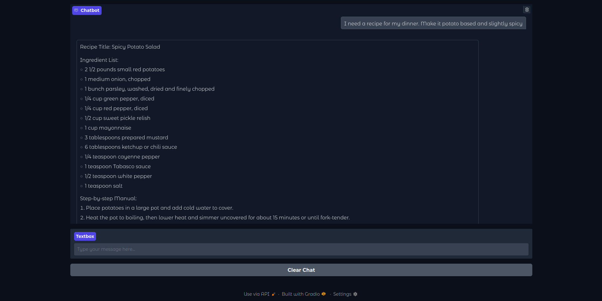
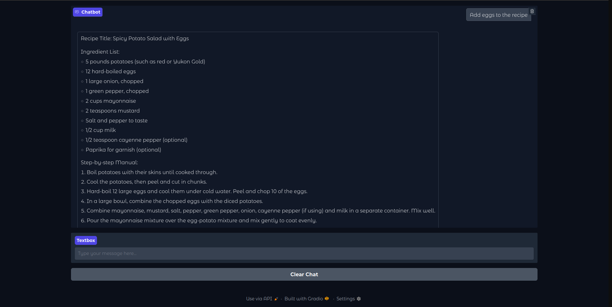

# Recipe-Recommender RAG
The Recipe-Recommender is a tool to find a suitable recipe for your next meal. With access to over 200000 recipes a recipe tailored to your availanle ingredients and preferences can be found

## Step-by-step manual

1. Install requirements
``` 
pip install -r requirements.txt
```
2. Run data_preparation.ipynb 
3. Set up the vector store using create_vector_db.ipynb
4. Run recipe_ui.py to interact with the application


## Key Features
* Powered by Ollama + Mistral
* Chroma Vector Database
* User interface created with Gradio
* Chatbot with integrated session memory

## Sample use case
<p align="center">
    
    
</p>

## Dataset
https://www.kaggle.com/datasets/paultimothymooney/recipenlg